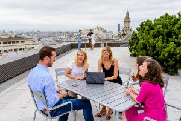

[home](/)

## A day in the life of an EPM

## A day in the life of an EPM

January, 2016

Originally posted on the Criteo blog [[link]](http://labs.criteo.com/2016/01/a-day-in-the-life-of-an-epm/)

Hi there!

A number of friends regularly ask us what an EPM is and what our job looks like. We also get the same questions from candidates at Criteo. So we thought it might be useful to give a little bit of insight into **the life of an Engineering Program Manager** (EPM) at Criteo!

**Criteo organization 101**

First of all, to understand the EPM job, you need to know a little bit about Criteo R&D organization. We have a [**full blog post on career tracks at Criteo**](http://criteolabs.wpengine.com/2015/06/criteo-engineering-career-tracks-and-leveling/), but here is a short version.

Our R&D is organized in small teams working together to finally serve our core business. Each team is composed of a handful of individual **engineers**, managed by a **lead** and has a **mission**. In our business, things go fast. These teams need to work in sync efficiently and to make sure that they deliver a useful product. This is where EPMs kick in.  EPMs are assigned to more than one team (typically 2 to 4 depending on the scope of the teams and the level of experience of the EPM). EPMs act as product owners : they are the link between technical, user and business issues and coordinate cross-team technical collaboration. They work in a transversal way with respect to the dev leads and the managers.

**Driving R&D projects**

At a high-level, the main mission of EPMs is to make sure that the **products and projects we deliver are successful for the company**. What do we mean by successful? These deliveries need to be :

**Relevant** : because building the right thing is what matters and, because we live in a rapidly changing environment, we need to constantly re-assess the goal of a product.
**Delivered** **on time** : there are many dependencies between teams at Criteo. Being late on a delivery may have a dramatic impact on another team. As EPMs, our mission is to constantly juggle dependencies and re-assess the relative priorities of projects.
Meet the **high-quality** standard we set ourselves at Criteo : building the right thing matters, but building it right matters too. EPMs find the perfect balance between technical debt and durability. In some cases, we&#8217;ll want to go fast and build a first prototype. In other cases, we&#8217;ll want to take the time to build projects with rock-solid foundations from the ground up.

Finally, we make sure requests and issues falling to teams are well defined, prioritized, communicated on and coordinated between teams who need to work together inside and outside R&D.

**OKR&#8230; WTF?**

At Criteo, we&#8217;ve found OKRs to be a powerful method for managing projects. **OKR stands for Objectives and Key Results** and were born at Intel before becoming widespread by Google. Our R&D adopted this initiative in 2013. Since then, each team validates a list of OKRs representing their **mission every quarter**, making sure they are timely and technically feasible, well coordinated across R&D and of course, consistent with our strategy. This list is shared across the company, showing dependencies explicitly so that everyone can understand what others are doing and what are the impacts.

Talking about strategy, our Product managers regularly refresh and share the **long-terms visions **for each project.

Both OKRs and long-terms visions are built from Product managers&#8217; strategic inputs but also from the Engineering teams&#8217; ideas and technical constraints. And this is where EPMs help structure projects, ease communication and enable collaboration. **EPMs help teams build the strategy and produce high-quality solutions efficiently.**

Finally, we don&#8217;t have a specific budget allocated per team each quarter to decide which projects get launched and which don&#8217;t. Instead, we answer the following question : **what is the best product we can confidently deliver with a team in the next quarter, and how does it align with our long-term strategy** ? Obviously, when needed, you’re allowed to develop your teams by hiring internally or externally, or using our well-known [**Voyager program**](http://criteolabs.wpengine.com/2015/07/internally-mobile/). This task is the responsibility of the managers, but EPMs contribute to the staffing strategy.

**Every day is a new day**

And then there&#8217;s the everyday job.  Candidates often ask us : what&#8217;s a typical day for an EPM?  And our answer always is : there is none!  **Every day is different** and comes with its share of surprises and unexpected events. We need to sync with both stakeholders including product managers, and several R&D teams. The only one thing that you&#8217;ll find in your everyday schedule are standup meetings.  Each team runs a 10-min standup in the morning.

*Morning stand-up. Photo credits: Sylvain Cambron Cbre ID*

As an EPM, attending these meetings is the golden way to keep in touch with the team.  And then what?  Well, here are a few things that make the core of an EPM day:

**Discussing the product** : discussing requirements with Product teams, collecting technical requirements from other teams, making sure Product and R&D&#8217;s understanding are aligned and making priority calls on projects
**Building stuff** : spending time with the teams &#8220;in the trenches&#8221;, designing things at high-level and low-level, communicating on projects milestones and status, tracking and coordinating dependencies.
**Recruiting** : like any member of R&D, EPMs actively participate in the recruiting effort and help running interviews.
**Having fun** : yes, we like going out on team building with fellow engineers and EPMs!
**Learning new things** : whether it&#8217;s from traditional training, a MOOC or an insider&#8217;s training, there&#8217;s plenty of room for learning new things either in the technical world or the project/people management area.
**Hacking things**: just because you&#8217;re managing project does not mean you can&#8217;t get your hands dirty once in a while.  Criteo offers plenty of opportunities for hacking stuff during working hours (10% projects, hackathons, startup-like projects) and EPMs actively participate in these activities.  In fact, their transverse vision often helps building truly innovative products.

**Ah, meetings!**

Apart from the daily standups with each team, the rest is up to you.  We try to use direct interaction (talk / email / chat) as much as we can. But we also recognize that sometimes, meetings are necessary.  When that happens, we use a few tricks to make them more efficient :

25- or 50-min rule : Using a tight schedule forces everyone to stay focus on the goal of the meeting and free the room for the coworkers. We also have dedicated corners in addition to meeting rooms to ease discussions. We even have them on the rooftop sometimes!

*Typical meeting on our rooftop. Photo credits: Sylvain Cambron Cbre ID*

defining the goal of the meeting and taking notes : these are obvious things to do, but when done well, they dramatically improve the efficiency of meetings.
defining a follow-up plan : the idea here is to end every meeting by reminding everyone of the things that have been decided, and who is now in charge of what. This step takes no longer than 60 seconds and is useful to make sure everyone is on the same page.
Could this meeting have been made shorter ?  This is a question that we ask ourselves regularly after a meeting. This helps us improve the efficiency of our meetings even more.

And of course, some of our meetings are particularly successful at Criteo.  We hold a Global and R&D All-Hands meeting every month or so.  These meetings help us stay tuned about what&#8217;s happening in the company and showcase our work!

**Feeling excited?**

I guess you get the idea.  As an EPM, you&#8217;ll need to demonstrate a keen sense of ownership for managing end-to-end projects, while balancing competing priorities all the time. Because we work in tight integration with the teams, influencing without authority is key.  And since we are exposed to a variety of groups, excellent oral and written communication and presentation skills will be a great asset. We interact with both technical and non-technical audiences, and that&#8217;s probably what makes the job so interesting.

If you feel you’re fit for the job, we&#8217;re currently  recruiting. Please look and apply [here](http://criteolabs.wpengine.com/wp-content/uploads/2015/04/job_Engineering-Program-Manager.pdf).
