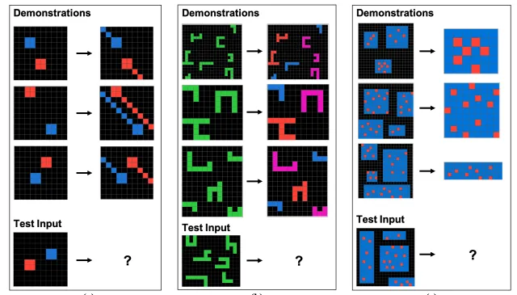

[home](/)

## AI has crossed the Rubicon. Now what?

The X1 airplane was the first plane to break the sound barrier. It was unclear what would happen when going faster than sound.

On October 14, 1947, a human pilot broke the sound barrier for the first time onboard the X1 airplane. Nobody knew whether it was really possible. That day marked the beginning of a new era in human flight.

March 2023 marks a similar defining moment in the history of Artificial Intelligence. That month, GPT4 came to the world. And the field would never be the same again. Nine months later, LLMs are everywhere and the world is still trying to make sense of what happened.

Have we reached a singularity moment? Is this the advent of AGI?

In 1950, computer science pioneer Alan Turing suggested a defining test of intelligence for the machine. The Turing test (originally called the Imitation Game) stated that if a human tester interacting with a machine via texting was unable to tell whether they were interacting with a machine or a human after five minutes, the machine had passed the test.

*"I believe that in 50 years' time it will be possible to make computers play the imitation game so well that an average interrogator will have no more than 70% chance of making the right identification after 5 minutes of questioning."*

-- Alan Turing, 1950

In May 2023, researchers at AI21Lab conducted a large-scale study with 1.5 million users who engaged in 2-minute conversations with either a human or the machine. In the cases where humans were facing the machine, they made the right guess 60% of the time, i.e. not much higher than chance [1]. While we cannot conclude from this single study that AI has passed the Turing test for good, these results are deeply troubling. Alan Turing's prediction may not be far off.

Yet, many researchers do not consider the Turing test as a valid test of intelligence for the machine. Just because a machine can speak like a human does not mean that it has gained the ability to reason. And in fact, the internet is filled with examples of illogical (not just incorrect) answers provided by GPT4.

In 2020, a little bit before the LLM wave, Google researcher Francois Chollet proposed a new test of intelligence for the machine, in the form of simple visual-based questions: the ARC Challenge. This challenge captures the ability to make abstractions from everyday knowledge and apply those to previously unseen problems. Humans solve 80% of the tasks on average [2] while GPT-4 still lags behind (in May 2023, researchers at the Santa Fe Institute fed a simplified version of the test, ConceptARC, to GPT4 which reached an accuracy below 30% on 15 of the 16 tasks [3]). Granted, the ARC challenge is biased against GPT4 as GPT4 was first designed as a text model, not a vision model. Yet, the performance discrepancy with humans is telling.

Sample tasks from the ARC challenge. Given a few examples, the task of the solver is to provide the output for a new test by applying general rules inferred from the examples. [4]

In short, while GPT4 seems to be indistinguishable from human intelligence to ChatGPT users, it still fails to match humans at general intelligence tests.

It is tempting to see in these tests a dangerous distraction. By anthropomorphizing AI, they steer researchers away from understanding the more general impact of the AI they have built. Planes don't flap wings. Why should we try to build machines that think and act like humans, when in reality they should be doing the exact opposite of that: be good at what humans are bad at and act as copilots in our daily lives?

Not everyone agrees. An entire field of research, Neuro-symbolic AI, powered by lead cognitive scientists such as Gary Marcus, aims at filling the gaps of deep learning with robustness and generalization capabilities. Yann LeCun, one of the pioneers of deep learning, also insists that current generations of LLMs are good at rote learning and fluency, but terrible at building mental models of the world and reasoning around them. He proposes a new approach in a seminal paper "A Path Towards Autonomous Machine Intelligence" [5].

In short, these models are good at "System 1" reasoning, but fall short of "System 2" thinking, as proposed by Daniel Kahneman in Thinking Fast and Slow.

Yet, really good system 1 thinking is a revolution already. The whole ML community came to a halt in 2016 when AlphaGo beat the world's best go player Lee Sedol. The same team went on to master very complex games such as StarCraft as well as protein structure prediction with AlphaFold.

AI has become a sixth sense for us, both as individuals (when we use ChatGPT to answer our daily questions) or as a species (when we use graph neural networks to discover new antibiotics [6]).

The new generation of AI is now out in the wild. It is massive, open-source, and pervasive. AI has now entered a virtuous circle, in which each generation of AI can be used to build the next one. The biggest AI chip maker in the world, NVIDIA, reckons that they use AI to design their chips [7], which in turn are used by the whole community to build new machine learning algorithms. As models become multimodal and extend their reach from text to vision and speech, their capabilities will increase even further.

There will likely be no singularity moment in AI. The revolution has started and will likely have an impact of similar magnitude as the discovery of the atom. We are in 2024, and we just broke the sound barrier!

[1] [https://arxiv.org/pdf/2305.20010](https://arxiv.org/pdf/2305.20010)

[2] https://arxiv.org/abs/2103.05823

[3] [https://arxiv.org/abs/2305.07141](https://arxiv.org/abs/2305.07141)

[4] [https://github.com/fchollet/ARC](https://github.com/fchollet/ARC)

[5] [https://openreview.net/forum?id=BZ5a1r-kVsf](https://openreview.net/forum?id=BZ5a1r-kVsf)

[6] [https://www.nature.com/articles/s41586-023-06887-8](https://www.nature.com/articles/s41586-023-06887-8)

[7] [https://blogs.nvidia.com/blog/llm-semiconductors-chip-nemo/](https://blogs.nvidia.com/blog/llm-semiconductors-chip-nemo/)

*Thank you to Romain Sabathe for reading drafts of this article.*

[Tweet](https://twitter.com/share?ref_src=twsrc%5Etfw)
