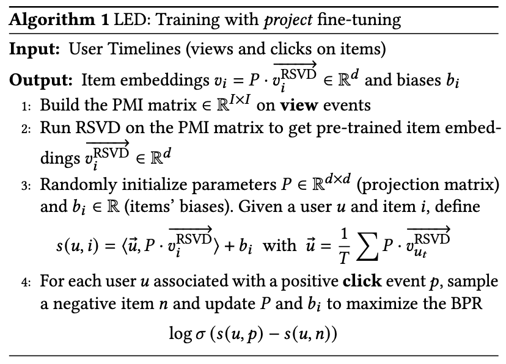
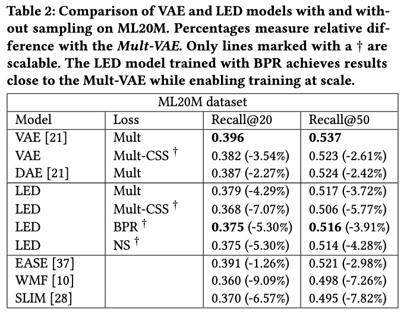
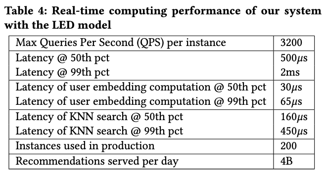
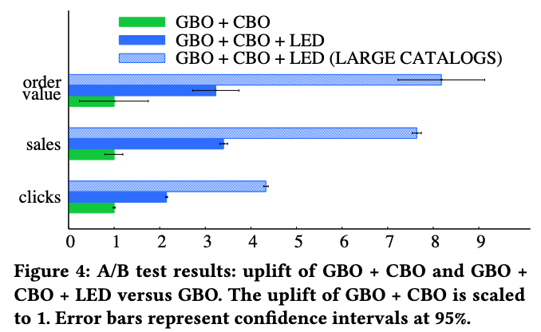

[home](/)

## Lightweight Representation Learning For Efficient And Scalable Recommendation

In 2019, we set up a team to revamp the machine learning models behind our recommendation engine at Criteo. The existing engine had been optimized for years. It was based on large-scale logistic regression and collaborative filtering ([RecSys'15 paper](https://dl.acm.org/doi/abs/10.1145/2792838.2799498)). The time had come for a makeover.

We tried several approaches before landing on an efficient encoder-decoder architecture. We shipped it to production and delivered a significant revenue uplift for Criteo.

We named our approach LED, for Lightweight Encoder-Decoder. LED provides a 30x speed-up in inference time with little performance loss against the best known baselines. This blog post provides a light introduction to the [arxiv paper](https://arxiv.org/abs/2101.00870v2).

The paper provides a detailed description of our system architecture, from offline training to online inference, delivering 3200 queries per second with sub-millisecond latency on standard data center servers. We further demonstrate its operation over several months at scale.

We open-source the code as a modular library for tensorflow model training called DeepR. Our work should be of interest to practitioners wishing to deploy an efficient large-scale recommendation system in the real-world.

###
Recommendation in the real-world

The key constraints of a typical web scale recommendation engine are the following:

**Scale**: The recommendation system must work at the scale of billions of users and hundreds of millions of items.

**Latency**: The system should respond within a few milliseconds to fit the need for banner display on mobile and web applications.

**Churn**: Users enter and exit the system at a far higher rate than changes in the product catalog. The system should avoid having to recompute its parameters for each update in the user base.

**Multiple feedbacks**: Collected data usually involves different types of feedback (product views and sales, clicks on banners). We seek a design that will extract as much information as possible from the available data.

###
Efficient models for recommendation

While a significant literature existed on recommendation engines at large, we discovered that few of them focused on efficiency at scale. We based our approach on four design choices:

**Fast nearest-neighbor search**: Thanks to this formulation, we can leverage efficient approximate nearest neighbor techniques at inference time.

**Amortized inference**: The use of amortized inference consists in sharing the same procedure to compute user representations, effectively making the number of parameters to learn independent from the number of users and addressing user churn. This is one of the strengths of the Variational Auto-Encoders (VAE).

**Sampling-based losses**: The computational complexity of comprehensive losses like the multinomial and gaussian likelihoods is linear in the number of items which makes them unusable under our requirements. Instead, we can use ranking-based losses, such as Bayesian Personalized Ranking (BPR), Negative Sampling (NS), or approximation-based methods like Complementarity Sum Sampling (CSS).

**Pre-training**: While the final recommendation system is evaluated on click events, we can leverage the large amount of historical data (mainly view events) to pre-train the model. In practice, we pre-train item embeddings on view events using large-scale matrix factorization.

###
Lightweight Encoder-Decoder

From these principles, we derived a simple yet powerful approach. The model has few parameters, one embedding and one bias per item. It encodes each user timeline to derive the user representation via a simple average. Item embeddings are pre-trained using a large-scale randomized SVD library that Criteo open-sourced a few years before (spark-rsvd). The following figure summarizes the algorithm. How much simpler could it be? :)

Here is what the architecture looks like.

###
Benchmarks

We compared LED to the best methods available at the time, including VAEs and weighted matrix factorization. Here are the results.

We notice a small drop in performance compared to the best-performing method (VAE with a multinomial loss). We are now reaching the point where industrial concerns kick in. A pure performance-based approach would be unhappy with the performance loss and call it a day. In the real world, the story is different: what if we incorporate system complexity and real-time performance into the mix?

First, we evaluated our method in production. We noticed that LED was performing better than all other methods, including the VAE mentioned above. This could be explained by the difference in nature and distribution between a real-world dataset and ML20M.

###
Complexity analysis

The story becomes even more interesting if we do a complexity analysis. We denote d the embedding dimension, I the number of items and U the number of users. The number of parameters of LED is linear in the number of items (I * d item embeddings and I biases), but independent from the number of users U (contrary to NCF or matrix factorization methods). When using the Project fine-tuning method, the number of trainable parameters is even smaller, d * d + I.

Training requires multiple updates on each user timeline. Each update using one of the sampled losses is linear in the number of items in the timeline and the number of negatives N. As a result, the final training complexity is O(U * T * N), which has the advantage of not being quadratic in U or I (unlike EASE in O(I ^ 2.376) or the Mult-VAE in O(U * I)).

At inference, computing the user representation is only linear in the number of items in the input timeline while finding the top-k best recommendations is roughly O(log(I)) thanks to efficient approximate nearest neighbors techniques.

This is what makes LED so efficient, allowing us to train the model in a few hours for millions of items and billions of users and to serve billions of requests per day. Below are the performance numbers per instance. The paper provides details about how we achieved this speed.

###
Show me the money!

We shipped our algorithm to production and observed significant revenue uplift compared to a naive most-popular approach (GBO) and a clustering-based approach (CBO). We literally tripled the sales uplift for the company. Needless to say, our approach has been running in production since then :)

###
Conclusion

We're excited to share our work on efficient and large-scale recommendation. The LED architecture reaches a new trade-off between complexity, scale and performance. By combining pre-training, sampled losses and amortized inference, LED brings a 30x speed-up in latency while reaching the performance of variational auto-encoders on standard recommendation metrics. If you're interested, check out the [code](https://github.com/criteo/deepr) and the [paper](https://arxiv.org/abs/2101.00870v2)!

[Tweet](https://twitter.com/share?ref_src=twsrc%5Etfw)
