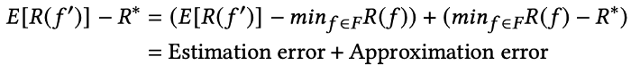
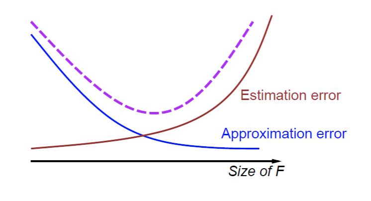
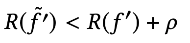
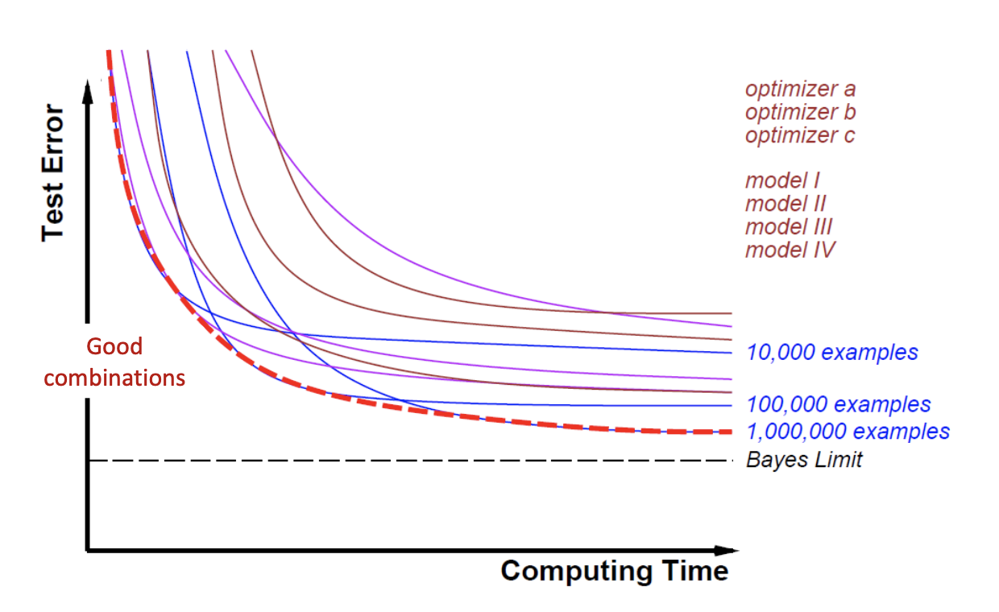
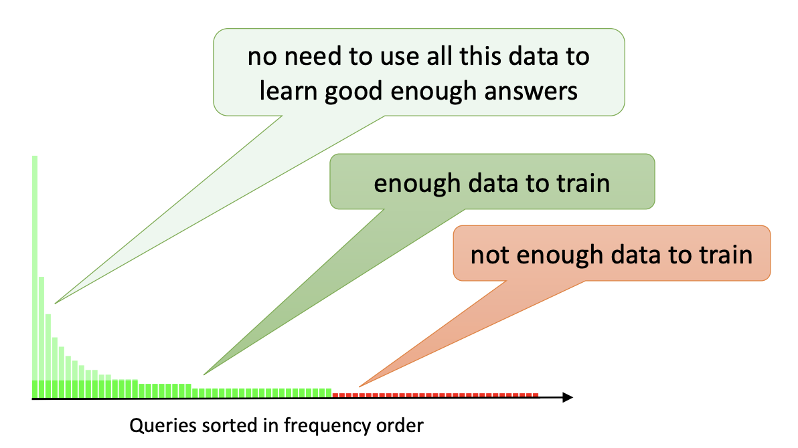

[home](/)

## Large-scale machine learning: the price of time

What defines large-scale machine learning?  This seemingly innocent question is often answered with petabytes of data and hundreds of GPUs. It turns out that large-scale machine learning does not have much to do with all of that. In 2013, Leon Bottou gave [a class](https://bigdata2013.sciencesconf.org/conference/bigdata2013/pages/bottou.pdf) on the topic at Institut Poincar&eacute;. The class is still as relevant today as it was then. This post is a short summary of it.

**The fundamental hypothesis of machine learning **

Most of the recent progress in machine learning progress has been driven by the paradigm of learning by which we train a model &#402; from existing data. We estimate &#402; using a training set and measure the final performance using the test set. The validation set is used for determining the parameters of the model.

In practice, we proceed by taking two shortcuts.

Approximation error: because we cannot search through the infinite set of all possible functions &#402; in the universe, we work within a subspace of function F.

Estimation error: because the true data distribution is unknown, we do not minimize the risk, but the empirical risk computed from the available data.

In mathematical terms:

where f' is the best function given the dataset, R estimates the loss at f, and R* is the minimum statistical risk (true risk).

This approximation/estimation tradeoff is well-capture by the following diagram. Given a finite amount of data, we can trade approximation for estimation. As the model complexity grows, the approximation error decreases, but the estimation error increases (at constant amount of data). The question therefore becomes: how complex of a model can you afford with your data?

In the real world, we take a third shortcut:

Optimization error: finding the exact minimum of the empirical risk is often costly.  Since we are already minimizing a surrogate function instead of the ideal function itself, why should we care about finding its perfect minimum? We therefore accept to find the minimum within a certain error &#961;, such that:

The final error is therefore composed of three components: the approximation error, the estimation error and the optimization error. The problem becomes one of finding the optimal function space F, number of examples n and optimization error &#961; subject to budget constraints, either in the number of examples n or computing time T. L&eacute;on Bottou and Olivier Bousquet develop an in-depth study of this tradeoff in [The Tradeoffs of Large Scale Learning](https://papers.nips.cc/paper/3323-the-tradeoffs-of-large-scale-learning.pdf).

The fundamental difference between small-scale learning and large-scale learning lies in the budget constraint. Small-scale learning is constrained by the number of examples, while large-scale learning is constrained by computing time.

This seemingly simple definition of large-scale machine learning is quite general and powerful. While the term large-scale often triggers references to petabytes of data and thousands of GPUs, practitioners often realize that these aspects are irrelevant to the underlying constraint (computing time).

With this definition in mind, you could be working on a truly gigantic dataset such as the entire Google StreetView database and have access to a supercomputer allowing to iterate extremely fast on the full dataset, you would still not be doing large-scale machine learning.

**The constraint of time **

Being constrained by time, large-scale learning induces more complex tradeoffs than small-scale learning. We need to make an optimal choice of F, n and &#961; within a given time budget. Because time is the bottleneck, we can only run a limited number of experiments per day.  Therefore, these choices are often made concurrently. If we choose to decrease the optimization error &#961;, a constant time budget forces us to reduce either the complexity of the model or the number of examples, which in turns has adverse effects on the estimation and approximation errors.

In practice, we often proceed by sampling all possible configurations and end up with a graph like the one below.  The optimal configuration depends on the computing time budget (i.e. different time budget yield different optimal configurations).

**Focusing on the data and the task **

Another striking difference between small-scale and large-scale machine learning are the focus of the effort. With small-scale machine learning, a lot of the focus is on the model and the algorithms. With large-scale machine learning, the focus shifts towards the data and the task. The time spent on the task and the data is significant and often much larger than anticipated.

Why?
- Experiments cost more at scale (in hardware and engineering time). Therefore, the cost of working with bad data or on the wrong task is higher. In this context, it makes sense to spend extended periods of time just discussing the task or doing data cleanup. This is not such a bad thing actually. For some reason, I always feel some comfort seeing engineers and researchers discuss the task at length. Something deep inside my engineering self makes me think that these hours of discussion might save us a lot more time down the road. The sarcastic software engineering saying "weeks of coding can save hours of planning" can be translated in the machine learning world into: "weeks of training can save hours of task definition".
- Large-scale systems tend to be more dynamic and to interact with the real-world. This, in turn, induces more opportunity for data quality issues as well as questions around what the model is trying to achieve exactly (e.g. should we take into account the causality effects?)
- Large datasets allow for more features and more complex models. More features mean more time spent on data quality. More complex models, on the other hand, almost always translate into initially disappointing results immediately followed by a questioning of the task the model is trying to solve (instead of an even more complex model).

Focusing on the data requires to think about which kind of data is most valuable to add. Let's assume for instance that we are working on a multi-class classification model. Adding more data will probably make the model more accurate. However, accuracy improvements are subject to diminishing returns. On the other hand, breadth improvements are not: adding examples of new classes that were never seen before could improve the model significantly.

It is therefore best to focus on queries near the boundary of the known area (a technique referred to as active learning).

**Engineering learning systems, at scale **

The typical approach to solving a complex problem in large-scale machine learning is to subdivide it into smaller subproblems and solving each of them separately. The training strategy can be either (1) training of each module independently (2) sequential training (use input of module n and train module n+1 with it), or (3) global training. Global training is harder but often better. Training [neural networks for self-driving cars](https://www.youtube.com/watch?v=IHH47nZ7FZU&feature=youtu.be) provides a rich example of global training at scale. Global training comes with a number of challenges, however, such as some modules training faster than the others, data imbalance and modules overtaking on the learning capacity of the whole network.

**Deep learning and transfer learning **

One of the great discoveries of deep learning is how well pre-trained networks work for a task they have not be trained for. In computer vision for instance, surprisingly good performance can be obtained using the last layers of convnets trained on ImageNet. Generic unsupervised subtasks seem to work well.

Another formulation of this is known as transfer learning: in the vicinity of an interesting task (with expensive labels) there are often less interesting tasks (with cheap labels) that can be put to good use.

A typical example is the one of labeling faces on a database of pictures. While the interesting task might be expensive to label (face->name), another task might be much easier to label: are two image faces of the same person? A labeled dataset can simply be constructed by observing that two faces in the same image are likely to be different persons while faces in successive frames are likely to be the same person.

Solving a more complex task and transferring features often allows us to leverage more data of a different nature.

### Conclusion

Large-scale machine learning has little to do with massive hardware and petabytes of data, even though these appear naturally in the process. At scale, time becomes the bottleneck and induces complex and concurrent trade-offs on the function space, the size of the dataset, and the optimization error.

The focus expands from the models to the data and the task. New engineering challenges arise around distributed systems. In short, things get a lot more fun.

[Tweet](https://twitter.com/share?ref_src=twsrc%5Etfw)
