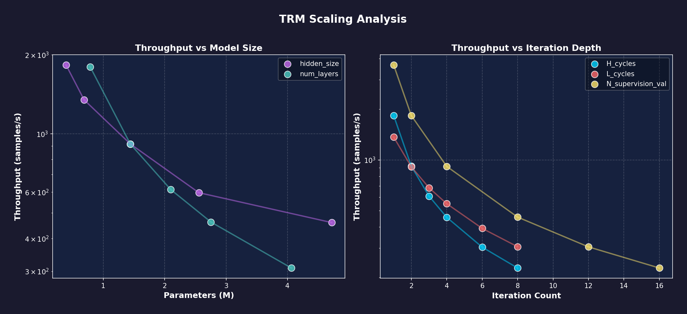
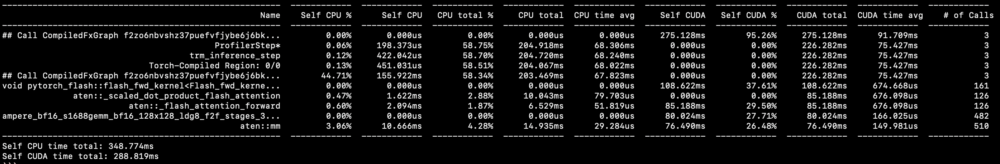

[home](/)

TRM have achieved impressive results on various puzzle benchmarks but come with a significant compute footprint. This is a series of two posts that cover the topic, from the inference and training standpoint.

This post focuses on the inference time. Here is the link to the [training one](trm-training-benchmark.html).

TRM is compute-intensive by design since it iterates multiple times over the same data (both a training time and inference time) and uses attention over the entire input (no pooling or patching). 
    As such, TRM is significantly more expensive than computer vision baselines and is not expected to be a competitive alternative. TRM is more useful for tasks that require reasoning (puzzle, math, planning).

TRM benefits from FlashAttentation natively on Ampere GPUs (through `torch.nn.functional.scaled_dot_product_attention`). We expect inference time to grow quadratically with the input size with float32, but less so for with bfloat16.

### Setup

We use two types of baselines:
- discriminative models (e.g. resnet)
- generative models (e.g. diffusers)

Here is our setup:

- We select various model architectures
- For each, we run inference a number of times (after some warmup)
- We report the average throughput
- We enable compilation by default (mode=default for TRM due to graph breaks, reduce-overhead for all other models)
- We run the benchmark with both torch.float32 vs torch.bfloat16. This makes a big difference as bfloat16 enables flash attention with torch>=2.0

Link to the [source code](https://github.com/olivkoch/nano-trm/blob/main/tests/src/nn/benchmarks/benchmark_trm_inference.py)

TRM has several hyper-parameters that have significant influence on its reasoning capacity but also compute requirements. Specifically, H_cycles, L_cycles, num_layers and the number of supervision loops.
We therefore benchmark three flavors of TRM (light, medium and heavy) capturing a large spectrum of complexity:
- TRM-Light: N_supervision_val=2, num_layers=1, H_cycles=1, L_cycles=1, hidden_size=128, num_heads=4
- TRM-Medium: N_supervision_val=4, num_layers=2, H_cycles=2, L_cycles=2, hidden_size=256, num_heads=8
- TRM-Heavy: N_supervision_val=16, num_layers=4, H_cycles=3, L_cycles=6, hidden_size=512, num_heads=8

Here are the baselines:
- ResNet-18
- ResNet-50
- EfficientNet-B2
- Diffusion Transformer

We run the benchmark on increasing input size (from 32x32 to 128x128). Each step doubles the surface of the image (i.e. the image width/height is multiplied by sqrt(2)).
We use a constant batch size of 32. While bigger batches might lead to faster inference, bigger batches lead to OOMs or long computing times for some models. The benchmark is run on an A100 SXM4 40GB.

### Results

The raw results are linked here: [float32](https://github.com/olivkoch/nano-trm/blob/main/results/benchmarks/float32-inference.txt) [bfloat16](https://github.com/olivkoch/nano-trm/blob/main/results/benchmarks/bf16-inference.txt)

**Learning #1: Discriminative models are orders of magnitude faster than TRM, but TRM and Diffusion Transformers are in the same ballpark** This is not surprising because they embed significant optimizations/inductive bias (pooling, patching) that TRM does not have. It makes little sense to try to use a TRM for a pure discrimination task. 
A medium TRM is in the ballpark of a diffusion transformer. A lighter one is much faster, while a heavier one is much slower.

| Input Size | ResNet18 (Discriminative) | TRM-Medium (Reasoning) | DiT-Medium (Generative) | Speedup (ResNet vs TRM) | Speedup (TRM vs DiT) |
| :--- | :--- | :--- | :--- | :--- | :--- |
| **32x32** | 66,941 img/s | 2,690 img/s | 1,255 img/s | **25x** | **2.1x** |
| **46x46** | 37,767 img/s | 1,133 img/s | 517 img/s | **33x** | **2.2x** |
| **64x64** | 33,616 img/s | 435 img/s | 223 img/s | **77x** | **2.0x** |
| **90x90** | 33,227 img/s | 125 img/s | 75 img/s | **266x** | **1.7x** |
| **128x128** | 23,934 img/s | 35.6 img/s | 23.4 img/s | **672x** | **1.5x** |

**Learning #2: BFloat16 is a "Free Lunch" for TRM** It not only makes inference much faster (first table) but reduces the quadratic complexity through FlashAttention (second table).

| Input Size | TRM-Medium (FP32) | TRM-Medium (BF16) | Speedup |
| :--- | :--- | :--- | :--- |
| **32x32** | 721 img/s | 2,690 img/s | **3.7x** |
| **46x46** | 195 img/s | 1,133 img/s | **5.8x** |
| **64x64** | 58.6 img/s | 435 img/s | **7.4x** |
| **90x90** | 15.6 img/s | 125 img/s | **8.0x** |
| **128x128** | 3.91 img/s | 35.6 img/s | **9.1x** |

The bfloat16 casting breaks the "quadratic wall" of full attention:

| Input Size | FP32 Throughput | FP32 Slowdown (vs 32x32) | BF16 Throughput | BF16 Slowdown (vs 32x32) |
| :--- | :--- | :--- | :--- | :--- |
| **32x32** | 721 img/s | **1.0x** | 2,690 img/s | **1.0x** |
| **46x46** | 195 img/s | **3.7x** | 1,133 img/s | **2.4x** |
| **64x64** | 58.6 img/s | **12.3x** | 435 img/s | **6.2x** |
| **90x90** | 15.6 img/s | **46.4x** | 125 img/s | **21.5x** |
| **128x128** | 3.91 img/s | **184.4x** | 35.6 img/s | **75.5x** |

### Impact of hyper-parameters

Let's go deeper into TRM and analyze its inference time with respect to its main hyperparameters. We run inference with a fixed batch size (512) and fixed input (32x32). We get the following results.

| Setting | Value |
|---------|-------|
| Device | CUDA |
| Precision | BF16 |
| Input | 32×32 (seq_len=1024) |
| Batch size | 512 |

**Base config:** hidden_size=256, num_layers=2, H_cycles=2, L_cycles=2, N_supervision_val=4

---

#### H_cycles (high-level iterations)

| H_cycles | Latency (ms) | Std (ms) | Throughput (samples/s) | Params |
|----------|--------------|----------|------------------------|--------|
| 1 | 278.52 | 0.52 | 1838.3 | 1.44M |
| 2 | 558.58 | 0.64 | 916.6 | 1.44M |
| 3 | 840.24 | 0.89 | 609.3 | 1.44M |
| 4 | 1123.33 | 1.97 | 455.8 | 1.44M |
| 6 | 1688.67 | 1.79 | 303.2 | 1.44M |
| 8 | 2247.20 | 0.98 | 227.8 | 1.44M |

---

#### L_cycles (low-level iterations)

| L_cycles | Latency (ms) | Std (ms) | Throughput (samples/s) | Params |
|----------|--------------|----------|------------------------|--------|
| 1 | 374.43 | 0.48 | 1367.4 | 1.44M |
| 2 | 562.83 | 0.67 | 909.7 | 1.44M |
| 3 | 749.99 | 0.59 | 682.7 | 1.44M |
| 4 | 932.28 | 0.92 | 549.2 | 1.44M |
| 6 | 1306.26 | 1.83 | 392.0 | 1.44M |
| 8 | 1679.84 | 1.79 | 304.8 | 1.44M |

---

#### num_layers

| num_layers | Latency (ms) | Std (ms) | Throughput (samples/s) | Params |
|------------|--------------|----------|------------------------|--------|
| 1 | 284.42 | 0.41 | 1800.2 | 0.79M |
| 2 | 559.89 | 0.62 | 914.5 | 1.44M |
| 3 | 833.26 | 0.74 | 614.5 | 2.10M |
| 4 | 1108.27 | 1.19 | 462.0 | 2.75M |
| 6 | 1658.76 | 1.71 | 308.7 | 4.06M |

---

#### N_supervision_val (reasoning steps)

| N_supervision | Latency (ms) | Std (ms) | Throughput (samples/s) | Params |
|---------------|--------------|----------|------------------------|--------|
| 1 | 139.55 | 0.13 | 3668.8 | 1.44M |
| 2 | 279.26 | 0.28 | 1833.4 | 1.44M |
| 4 | 559.65 | 0.45 | 914.9 | 1.44M |
| 8 | 1119.74 | 1.03 | 457.2 | 1.44M |
| 12 | 1682.59 | 3.14 | 304.3 | 1.44M |
| 16 | 2246.39 | 5.05 | 227.9 | 1.44M |

---

#### hidden_size

| hidden_size | Latency (ms) | Std (ms) | Throughput (samples/s) | Params |
|-------------|--------------|----------|------------------------|--------|
| 128 | 279.59 | 0.04 | 1831.2 | 0.39M |
| 192 | 379.83 | 0.76 | 1348.0 | 0.69M |
| 256 | 559.38 | 0.48 | 915.3 | 1.44M |
| 384 | 857.03 | 1.35 | 597.4 | 2.56M |
| 512 | 1113.58 | 1.13 | 459.8 | 4.72M |

---

### Summary

| Parameter | Scaling | 1× → Max | Slowdown |
|-----------|---------|----------|----------|
| H_cycles | Linear | 1 → 8 | 8.1× |
| L_cycles | Sublinear | 1 → 8 | 4.5× |
| num_layers | Linear | 1 → 6 | 5.8× |
| N_supervision | Linear | 1 → 16 | 16.1× |
| hidden_size | Subquadratic | 128 → 512 | 4.0× |

This yields interesting findings:

- **L_cycles is cheaper than H_cycles** - At value=8, L_cycles achieves 304.8 samples/s vs H_cycles at 227.8 samples/s. This suggests L_cycles (inner loop) has less overhead per iteration than H_cycles (outer loop which resets z_H).
- **N_supervision scales perfectly linearly** - No overhead between supervision steps, just pure repeated computation.
- **hidden_size scaling is favorable** - Going from 128→512 (4x) only costs 4x in throughput despite 12x more parameters. The compute is dominated by sequence length, not hidden dimension.

### Profiling

We now profile the TRM inference with default compilation enabled. Below is the inference with `batch_size=2048` on a Sudoku 6x6 dataset.

This profile is healthy:

- Most of the CPU time is spent in `Call CompiledFxGraph`. This is the overhead of the Python runtime handing off the entire "fused" TRM reasoning loop to the GPU driver.
- The GPU is spending most of its time on core computation (37.6% on flash attention, 27.7% on matrix multiplication)
- The `ampere_bf16_s1688gemm` kernels are the "dense" math—the Linear layers in the MLP and the Q/K/V projections. These are utilizing the Tensor Cores (indicated by the s1688 nomenclature).

### Conclusion

A TRM is orders of magniture slower than a ResNet at inference time. This is not surprising given the differences in architecture. On the other hand, TRM and Diffusion Transformers are in the same ballpark. 

If you are going to use TRM for inference:
- Use bfloat16 casting and torch.compile (default mode)
- L_cycles are cheaper than H_cycles
- hidden_size scales sub-quadratically

